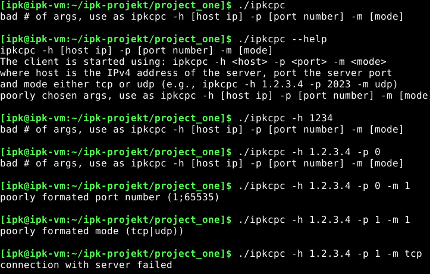
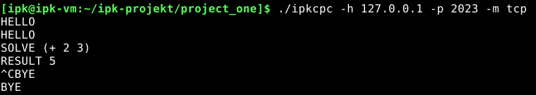
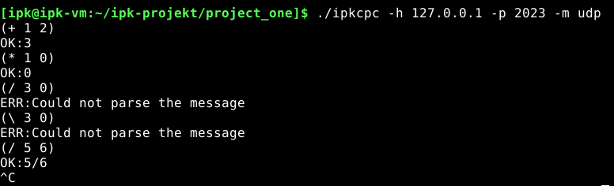

## IPK Calculator Protocol Client

### Autor: Pomsár Jakub

### xlogin: xpomsa00
### Content
- Required theory
- Description of interesting parts 
- Testing section
- Description of features beyond the specification

### Required theory
To implement the program correctly, it is necessary to understand the functioning of the communication protocols TCP and UDP. TCP is a reliable protocol that ensures that data will be delivered without errors and in order. It uses acknowledgments and retransmissions to guarantee that all data is received correctly. In contrast, UDP is an unreliable protocol that does not guarantee the delivery or order of data. However, it is faster and more efficient than TCP. 

When attempting to communicate with a server, both protocols require initializing a socket using the *socket()* function. The UDP protocol allows communicating with the target device after initializing the socket, so it is sufficient to use the *sendto()* function to send a message and then wait for a response using the *recvfrom()* function. In contrast to UDP, the TCP protocol requires a reliable connection to the server, which is established by the *connect()* function. Sending and receiving messages is then done using the *send()* and *recv()* functions. To end communication, it is enough to close the previously opened socket using the *close()* function.
### Description of interesting parts 
When using the client in UDP mode to send a message, the first and second byte must be occupied by the correct opcode value and the size of the data, respectively. The data starts from the third byte. However, when receiving data, an additional byte is shifted due to the control byte, which indicates whether it is an error or a correct response.

This implementation works as follows: first, the input is read from standard input. Then, a temporary buffer is created and the first two bytes of the temporary buffer are set accordingly. The data is then appended to the temporary buffer. Finally, the properly defined auxiliary buffer is copied into the array that is ready to be sent.

After receiving a message, it needs to be checked to determine whether it is a response or a request. If it is a response, it must also be checked to determine whether the status is *"OK"* or *"Error"*. Based on this information, the message is printed out accordingly.

### Testing section
Testing was performed to ensure that the IPKCPC client was functioning as expected. Basic functionality and error handling were tested manually on different machines, using different implementations of the IPK server (including variations created by other students), as well as on a virtual machine running the official provided server. 

The results of the tests were analyzed to identify any issues or areas for improvement. Any issues found during testing were addressed and resolved before the final submission of the implementation.
 

 

 

 

### Description of extra features
Every argument that is compiled with the program undergoes preprocessing to ensure that it is in the appropriate format, in form of validation  using regexes or other checks before being used. This is done to prevent errors and ensure that the program functions as expected.